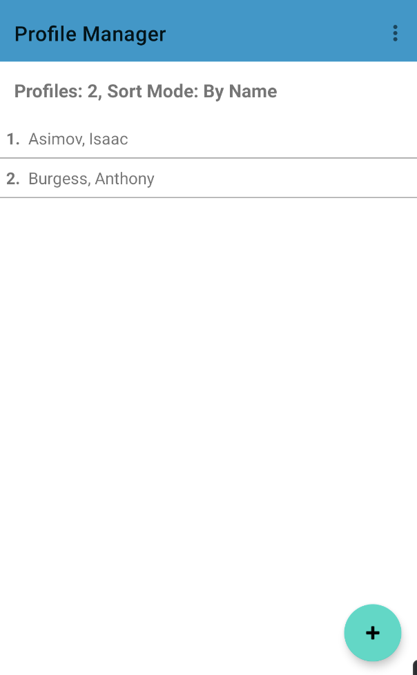
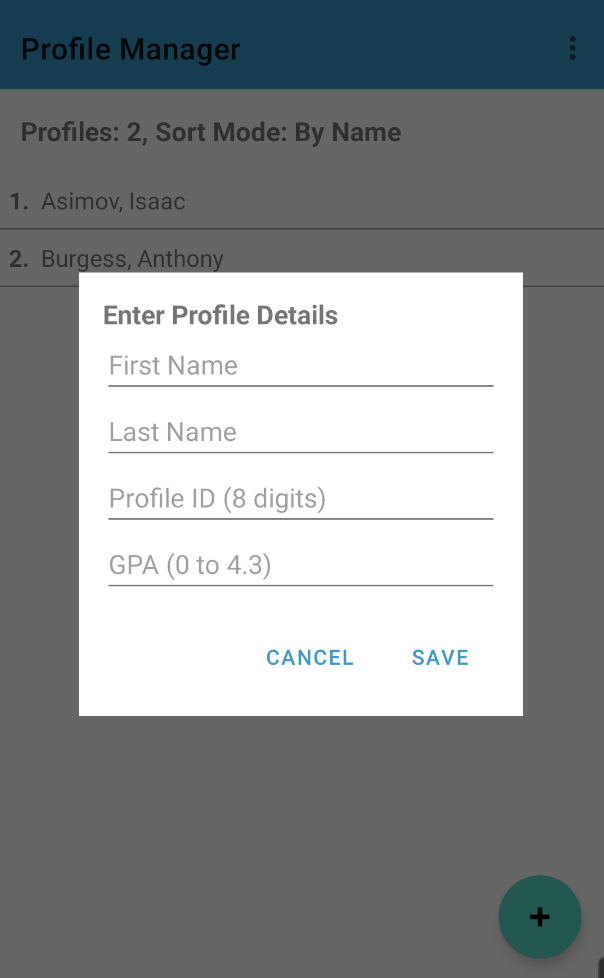
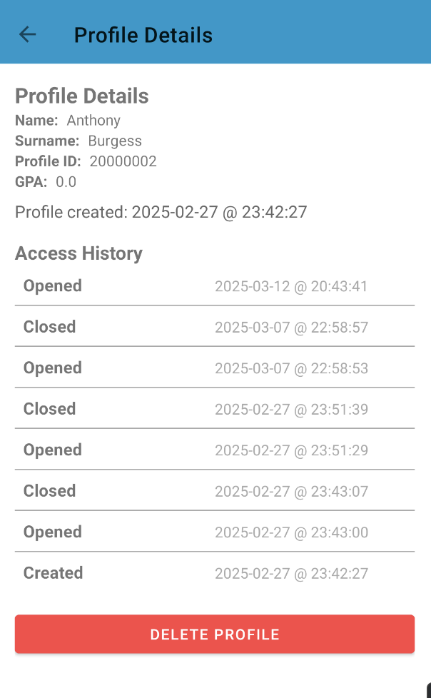

# Profile Manager

## 📌 About the App
**Profile Manager** is an Android application that allows users to create, manage, and track profiles with details such as name, surname, profile ID, and GPA. It features **sorting**, **profile access history logging**, and **persistent storage** using SQLite. The app follows an **MVC architecture**, ensuring a clean and maintainable structure.

---

## ✨ Features

✅ **Profile Creation**: Add new profiles with a unique **8-digit ID**, name, surname, and GPA.

✅ **Profile Deletion**: Remove an existing profile permanently with a single tap.

✅ **Profile Listing & Sorting**: View all profiles in a list and **toggle sorting** by ID or surname.

✅ **Profile Details**: Tap on a profile to see details including creation date and GPA.

✅ **Access History Tracking**: Logs whenever a profile is created, viewed, or deleted.

✅ **Material Design UI**: Uses Material Design components for a smooth user experience.

✅ **Persistent Storage**: Data is stored in an **SQLite database** and remains available across sessions.

---

## 🛠 Installation & Setup

### **1️⃣ Clone the Repository**
```bash
git clone https://github.com/FabioKoshy/ProfileManager.git
```

### **2️⃣ Open in Android Studio**
- Launch **Android Studio**.
- Select **File > Open** and navigate to the cloned repository.
- Allow **Gradle Sync** to complete.

### **3️⃣ Build and Install the APK**
#### **Method 1: Using Android Studio**
- Select **Build > Build Bundles/APKs > Build APK**.
- Locate the APK at `app/build/outputs/apk/debug/app-debug.apk`.
- Transfer the APK to your Android device and install it.

#### **Method 2: Using Terminal**
Run the following command:
```bash
./gradlew assembleDebug
```
The APK will be generated in `app/build/outputs/apk/debug/`.

### **4️⃣ Install the APK on Your Device**
```bash
adb install app-debug.apk
```
Ensure **USB Debugging** is enabled on your device.

---

## 🚀 Try It Online 
No need to install anything! You can test the app directly in your browser:

👉 **[Click here to run the app](https://appetize.io/app/b_tdsgjgpqun2nmohgfteqmqimnm)**

---

## Usage Guide

### **1️⃣ Main Screen (Profile List)**
- Displays all profiles, numbered.
- Shows total profiles and current **sort mode**.
- **Click** on a profile to view details.
- **Tap "+"** to add a new profile.

### **2️⃣ Adding a Profile**
- Enter **First Name**, **Last Name**, **Profile ID** (8 digits), and **GPA** (0 - 4.4).
- Click **Save** to create the profile.

### **3️⃣ Profile Details Screen**
- Displays **full profile info** and **access history**.
- Shows when the profile was **created**, **opened**, and **deleted**.
- **Tap "Delete Profile"** to remove the profile permanently.

### **4️⃣ Sorting Profiles**
- Tap the **menu button** (top-right corner) and select **Toggle Sort**.
- Profiles can be sorted by **ID** or **Surname**.

---

## ⚠️ Error Handling & Restrictions

- **All fields are required** when adding a profile.
- **Profile ID must be 8 digits**, unique, and numeric.
- **Name and Surname must contain only letters**.
- **GPA must be between 0 and 4.4**.
- **If the profile ID already exists**, an error message will be shown.
- **If an invalid input is detected**, the app will display a warning.

---

## 🤝 Contributing
Contributions are welcome! Follow these steps to contribute:

1. Fork the repository.
2. Create a new branch (`git checkout -b feature-branch`).
3. Commit your changes (`git commit -m 'Added new feature'`).
4. Push to the branch (`git push origin feature-branch`).
5. Create a **Pull Request**.

---

## 🏗 Architecture (MVC)

The app follows the **Model-View-Controller (MVC)** pattern:

- **Model:** Handles data storage and retrieval via `DatabaseHelper.java`.
- **View:** Includes `activity_main.xml`, `activity_profile.xml`, and other UI files.
- **Controller:** Business logic handled in `MainActivity.java`, `ProfileActivity.java`, etc.

---

## 🖼 UI Screenshots

| Main Screen | Add Profile | Profile Details |
|------------|------------|----------------|
|  |   |  |

---

## 📌 Technologies Used

- **Android SDK** (Java)
- **Material Design UI**
- **AndroidX Libraries** (AppCompat, RecyclerView, ConstraintLayout)

---

## 📬 Contact
For any questions or feedback, reach out via **phoenixfabio7@gmail.com**.

🚀 **Happy Coding!**

